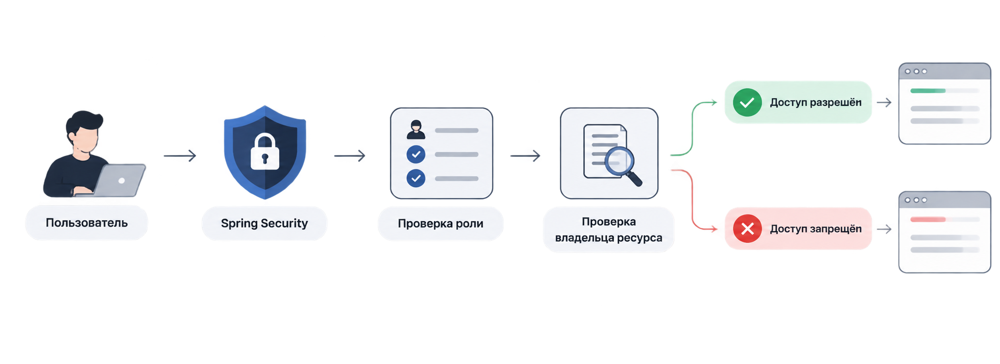
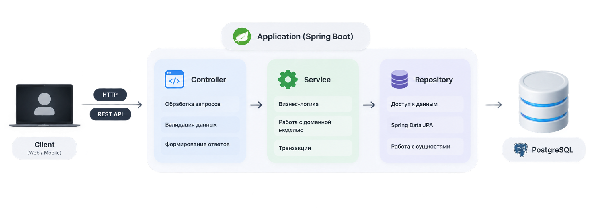
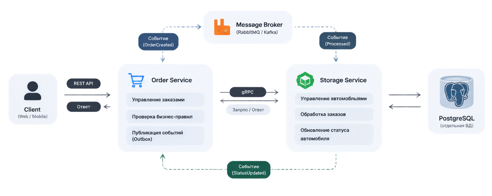
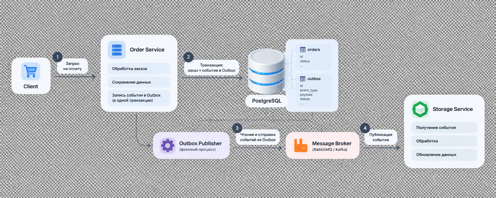
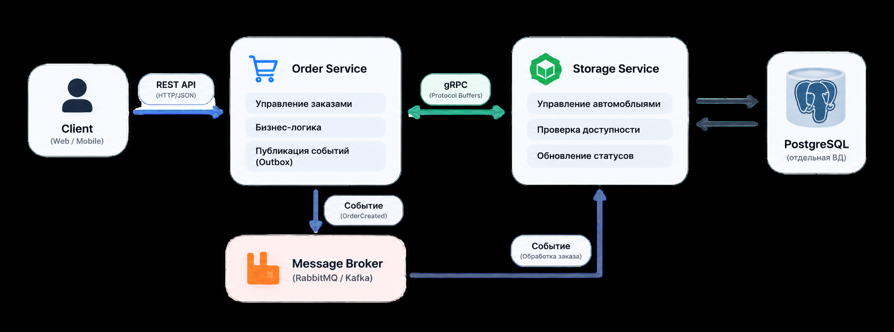

# Car Management System 🚘

## О проекте

**Car Management System** — это backend-система для автоматизации процессов работы с автомобилями: от выбора модели и создания индивидуальной комплектации до оформления заказа и подготовки автомобиля к выдаче.

Проект моделирует не просто хранение информации об автомобилях, а полноценный процесс взаимодействия между клиентом и различными отделами компании.

Клиент может подобрать автомобиль, собрать подходящую комплектацию и оформить заказ. Менеджер сопровождает процесс покупки. Администратор склада отвечает за наличие автомобилей и выполнение внутренних операций.

Каждое действие подчиняется бизнес-правилам: нельзя создать несовместимую комплектацию, изменить чужой заказ или выполнить операцию, которая не относится к роли пользователя.

---

# Основные возможности

## Конфигуратор автомобиля

Одной из центральных частей системы является возможность создания индивидуальной комплектации автомобиля.

Пользователь может выбрать дополнительные параметры автомобиля и получить итоговую стоимость выбранной конфигурации.

При этом система самостоятельно проверяет корректность выбора.

Например, если определённый компонент подходит только для одной модели автомобиля, его нельзя добавить в другую конфигурацию.

Таким образом, конфигуратор учитывает не только выбранные пользователем параметры, но и реальные ограничения предметной области.

---

## Работа с заказами

После выбора автомобиля пользователь может оформить заказ.

Заказ проходит несколько этапов обработки:

Каждый переход между состояниями контролируется системой.

Например, клиент не может самостоятельно изменить статус заказа на «готов к выдаче», потому что этот этап зависит от действий сотрудников и внутренних процессов компании.

Это позволяет сохранить корректность всего процесса покупки.

---

# Пользователи и права доступа

В системе предусмотрено несколько типов пользователей с разными зонами ответственности.

## Клиент

Клиент работает только со своими заказами.

Он может:

- создавать заявки;
- просматривать свои заказы;
- отменять собственные обращения.

При этом он не имеет доступа к внутренним операциям компании.

Например, клиент не может:

- изменять информацию о наличии автомобилей;
- выполнять складские операции;
- изменять рабочие статусы заказа.

---

## Менеджер

Менеджер отвечает за сопровождение заказов.

Он работает с заявками клиентов и выполняет операции, связанные с процессом оформления покупки.

---

## Администратор склада

Администратор склада отвечает за внутренние процессы:

- доступность автомобилей;
- складскую информацию;
- подготовку автомобиля.

---

## Проверка доступа

Система проверяет права доступа непосредственно перед выполнением операции.

Например, если пользователь пытается открыть заказ по идентификатору, проверяется не только факт авторизации, но и принадлежность этого заказа пользователю.

То есть знание адреса запроса не даёт доступ к данным, которыми пользователь не владеет.

Пример проверки:

---

## Работа с данными и API

Для взаимодействия с системой был реализован REST API.

Теперь пользовательские действия выполняются через HTTP-запросы, а приложение самостоятельно решает:

- можно ли выполнить операцию;
- какие данные вернуть;
- какие ограничения применить.

Внутри приложения ответственность разделена между отдельными слоями:

Каждый слой отвечает за свою задачу:

- **Controller** принимает запросы и формирует ответы;
- **Service** содержит бизнес-логику и правила работы системы;
- **Repository** отвечает за взаимодействие с данными.

Такое разделение позволяет изменять отдельные части приложения независимо друг от друга.

---

# Микросервисная архитектура

По мере роста проекта менялась и сама архитектура приложения.

Сначала система представляла собой приложение с общей бизнес-логикой, но затем, когда количество процессов увеличилось, система была разделена на независимые сервисы.

Основными частями стали:

## Order Service

Отвечает за работу с заказами:

- создание заказа;
- изменение его состояния;
- пользовательские сценарии.

---

## Storage Service

Отвечает за внутренние процессы:

- наличие автомобилей;
- складскую информацию;
- подготовку автомобиля.

---

Такое разделение позволяет каждому сервису заниматься своей задачей и развиваться независимо.

Например, увеличение нагрузки на складские операции не требует изменения части системы, связанной с клиентскими заказами.

---

# Обмен информацией между сервисами

После разделения системы на несколько сервисов появилась необходимость организовать их взаимодействие.

Так как разные процессы требуют разного подхода, в системе используются два типа коммуникации:

- **асинхронное взаимодействие** — когда сервисы обмениваются информацией через события и не требуют мгновенного ответа;
- **синхронное взаимодействие** — когда одному сервису необходимо сразу получить ответ от другого.

---

## Асинхронное взаимодействие через брокер сообщений

Для процессов, которые могут выполняться независимо от основного пользовательского запроса, используется асинхронное взаимодействие через брокер сообщений.

Например, после оплаты заказа сервис управления заказами должен уведомить склад о необходимости подготовки автомобиля.

Вместо прямого вызова одного сервиса другим отправляется событие в брокер сообщений.

Процесс выглядит следующим образом:

1. Order Service изменяет состояние заказа.
2. Создаётся событие о необходимости обработки заказа.
3. Событие отправляется в брокер сообщений.
4. Storage Service получает сообщение и выполняет необходимые складские операции.
5. После завершения обработки сервис отправляет результат обратно.

Такой подход позволяет сервисам работать независимо друг от друга.

Если склад временно недоступен, сервис заказов не блокируется и не ожидает выполнения операции. Сообщение сохраняется и будет обработано после восстановления работы сервиса.

---

## Надёжная отправка событий через Outbox Pattern

При использовании событийного взаимодействия возникает важная проблема: изменение данных и отправка сообщения должны происходить согласованно.

Например, нельзя допустить ситуацию: заказ уже оплачен, но склад не получил информацию о необходимости подготовки автомобиля.

Для решения этой проблемы используется паттерн **Outbox Pattern**.

При изменении состояния заказа информация о событии сначала сохраняется в специальную таблицу Outbox в рамках одной транзакции с изменением заказа.

После успешного сохранения отдельный процесс отправляет событие из Outbox в брокер сообщений.

Таким образом гарантируется, что:

- изменение данных не потеряется;
- событие будет отправлено;
- сервисы сохранят согласованность данных.

---

## Синхронное взаимодействие через gRPC

Для операций, где необходимо получить актуальный ответ в момент выполнения запроса, используется синхронное взаимодействие через gRPC.

Например, когда пользователь открывает список доступных автомобилей, сервис заказов не может использовать событие из брокера сообщений, потому что пользователю нужен результат прямо сейчас.

В этом сценарии:

1. Order Service получает запрос от пользователя.
2. Order Service отправляет gRPC-запрос в Storage Service.
3. Storage Service обращается к своей базе данных и получает актуальную информацию.
4. Результат возвращается обратно в Order Service.
5. Пользователь получает список доступных автомобилей.

gRPC был выбран для таких операций благодаря более строгому контракту взаимодействия между сервисами.

В отличие от обычного REST-вызова, где структура данных определяется через HTTP и дополнительные соглашения между разработчиками, gRPC использует заранее описанный контракт через `.proto` файл.

Это позволяет сервисам точно знать:

- какие данные отправляются;
- какой формат ответа ожидается;
- какие операции доступны.

Кроме того, gRPC использует бинарный формат передачи данных Protocol Buffers, что делает обмен между сервисами более компактным и быстрым.

В рамках данного проекта это позволяет использовать gRPC именно там, где важна скорость получения информации — например, при просмотре актуального списка автомобилей в наличии.

При этом gRPC не заменяет асинхронное взаимодействие, а дополняет его:

- события подходят для длительных процессов, где сервисам не нужно ждать мгновенного ответа;
- gRPC подходит для операций, где результат необходим сразу.

---

# Итог

Car Management System прошла путь от создания бизнес-модели до распределённой backend-системы.

В проекте реализованы не только операции с данными, но и полноценные архитектурные решения:

- управление автомобилями и заказами;
- создание индивидуальных комплектаций;
- проверка бизнес-правил;
- ролевая модель доступа;
- REST API;
- работа с PostgreSQL;
- микросервисная архитектура;
- асинхронное взаимодействие через брокер сообщений;
- обеспечение надёжной доставки событий с помощью Outbox Pattern;
- синхронное взаимодействие между сервисами через gRPC.

Каждое архитектурное решение используется для решения конкретной задачи:

- безопасность ограничивает действия пользователей в зависимости от их роли;
- микросервисы разделяют ответственность между частями системы;
- брокер сообщений позволяет сервисам взаимодействовать независимо;
- Outbox Pattern сохраняет целостность бизнес-процессов;
- gRPC обеспечивает быстрый обмен данными там, где необходим мгновенный ответ.

В результате система получила архитектуру, в которой отдельные компоненты могут развиваться независимо, сохраняя при этом согласованность данных и корректность бизнес-процессов.

---

# Технологии

### Backend

- Java
- Spring Boot
- Spring Data JPA
- Spring Security

### Database

- PostgreSQL

### Communication

- REST API
- gRPC
- Message Broker

### Infrastructure

- Docker
- Docker Compose

### Build System

- Gradle
